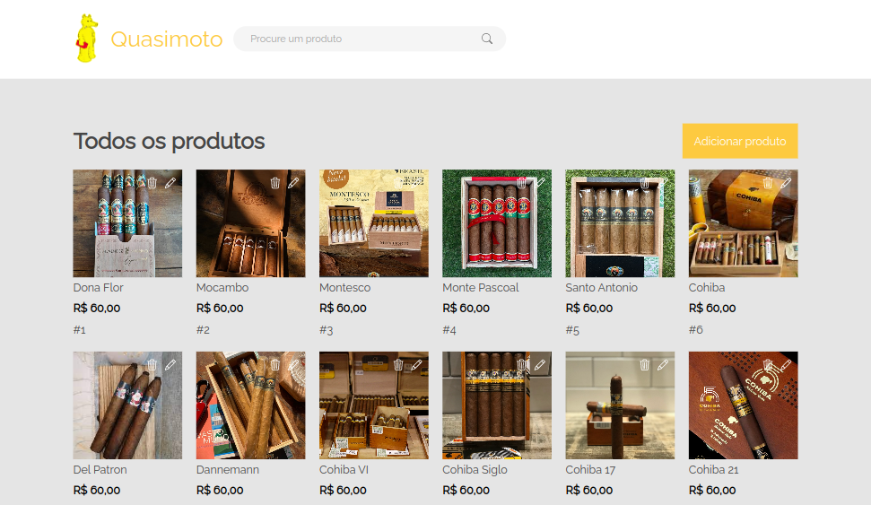

<h1>E-commerce - Challenge ONE 3</h1>

Site dinâmico desenvolvido com HTML, CSS, JavaScript e json-server para simular uma API que recebe requisições e permite que o usuário faça operações através de um CRUD e salve dados localmente

O usuário é capaz de  buscar, criar, atualizar e excluir produtos. O site é responsivo e pode ser visualizado em computadores e dispositivos móveis

Para acessar o site, clique <a href="https://one-ecommerce-quas.netlify.app/" target="_blank">aqui</a>

<h2>Interface de usuário intuitiva, é possível realizar as seguintes operações:</h2>

<li>Criar um novo produto clicando no botão "Adicionar produto" e preenchendo o formulário</li>
<li>Atualizar um produto clicando no botão "Editar" ao lado do produto e modificando o formulário</li>
<li>Excluir um produto clicando no botão "Excluir" ao lado do produto</li>
 
 

<h2>Rodar o projeto</h2>

<ol>
<li>Baixe o repositório</li>
<li>Abra o terminal do VSCode e execute o comando: json-server --watch db.json</li>
</ol>

